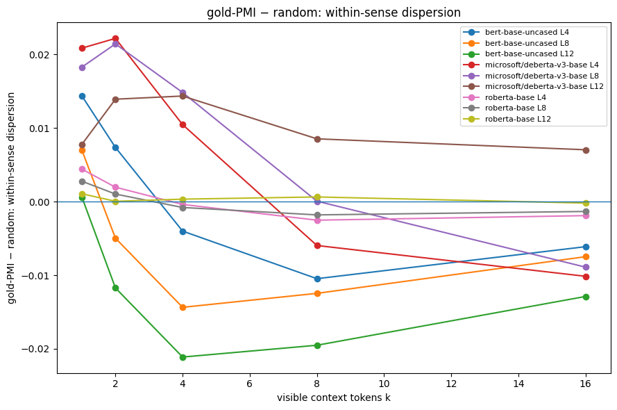

# Beyond Contraction

**Contextual evidence separates lexical senses without forcing same-sense representations to collapse.**

**Author:** Hồ Ngọc Huy · Undergraduate, University of Science, VNU-HCM · [ORCID 0009-0007-4156-352X](https://orcid.org/0009-0007-4156-352X)

This repository accompanies an exploratory preprint on the geometry of ambiguous-word representations in frozen BERT, RoBERTa, and DeBERTa-v3 encoders. The simple question is whether making a word's intended sense easier to identify also makes all occurrences of that sense geometrically tighter. In these experiments, the answer is **not universally**: diagnostic context reliably increases between-sense differentiation, while within-sense dispersion can decrease, stay nearly unchanged, or increase.

> **Status:** exploratory preprint, not peer reviewed. The strongest claim is empirical: *sense accessibility and within-sense geometric dispersion are different quantities*. “Sense-directed reorganization” is used as a descriptive summary, not as a proved universal mechanism.

[Read the rewritten preprint](paper/preprint.pdf) · [Read it as Markdown](paper/manuscript.md) · [Methods in plain English](docs/methods-map.md)

## Main result

The core experiment reveals the same number of context tokens in two ways: training-only **sense-diagnostic** ordering versus matched **random** ordering. Across the final resource run, between-sense separation is higher for diagnostic context in every aggregate model × layer × evidence cell, but within-sense dispersion does not have a universal sign.

| Question | Result |
|---|---|
| Does useful context make the intended sense easier to recover linearly? | Yes. |
| Do different senses become more geometrically differentiated? | Consistently in the controlled aggregate comparisons. |
| Must examples of the same sense contract into a tighter cloud? | No. |
| Does one diagnostic cue act like a pure shift along a single “sense axis”? | The data do not support that simple picture. |
| Is all previous context proven to be preserved? | No. A fixed low-dimensional lexical target remains largely recoverable; that is a narrower claim. |

<p align="center">
  
  
</p>

The follow-up experiments start from an identical base context, add one diagnostic or matched control cue, and then test sense accessibility, update direction, structural similarity, and recovery of a fixed old-context target. A final validation notebook replaces oracle cue selection with local context, applies LEACE to suppress linearly accessible sense signal, and checks external alignment on RAW-C.

## Repository map

```text
.
├── paper/
│   ├── preprint.pdf                    # concise rewritten preprint
│   ├── main.tex                        # LaTeX source
│   ├── manuscript.md                   # readable source version
│   └── anonymous_legacy_preprint.pdf   # earlier anonymous draft, kept for provenance
├── notebooks/
│   ├── paper/
│   │   ├── 03_experiment_a_controlled_evidence.ipynb
│   │   ├── 04_experiment_b_nested_update.ipynb
│   │   └── 05_experiment_c_validation.ipynb
│   └── development/                    # earlier pilots / research trail
├── figures/                            # curated figures extracted from executed outputs
├── results/                            # compact paper-facing CSV summaries
├── docs/methods-map.md                 # claim → measurement → interpretation map
├── REPRODUCIBILITY.md
├── AI_USE.md
├── AUTHOR.md                         # canonical author name, affiliation, ORCID
├── THIRD_PARTY_DATA.md
├── CITATION.cff
└── requirements.txt
```

## Reproduce

A GPU is strongly recommended for the full resource profile.

```bash
python -m venv .venv
source .venv/bin/activate            # Windows: .venv\Scripts\activate
pip install -r requirements.txt
jupyter lab
```

Run the three notebooks in `notebooks/paper/` in numeric order. They download CoarseWSD-20 and pretrained encoders on demand; the validation notebook also downloads RAW-C. Large embedding caches are deliberately excluded from version control. See [REPRODUCIBILITY.md](REPRODUCIBILITY.md) for exact experimental settings and what is / is not bundled.

## Scope before interpretation

Several tempting readings are intentionally *not* made here:

- linear probe gain is **not** treated as Shannon mutual information or human semantic entropy;
- a supervised sense subspace is **not** treated as an independently discovered privileged axis inside the model;
- fresh-decoder reconstruction of TF-IDF/SVD context is **not** evidence that every syntactic or semantic detail was preserved;
- LEACE supports claims about **linear accessibility**, not complete concept deletion;
- aggregate sign counts such as `45/45` are descriptive robustness summaries, not 45 independent replications.

These restrictions are part of the result, not after-the-fact caveats: the point is to separate what the geometry shows from what it is easy to read into it.

## Data and models

The repository does not redistribute third-party datasets or model weights. See [THIRD_PARTY_DATA.md](THIRD_PARTY_DATA.md). The resource runs use CoarseWSD-20, BERT-base-uncased, RoBERTa-base, and DeBERTa-v3-base; RAW-C is used only as an external semantic-validity check.

## AI assistance

This project used generative AI extensively during research scaffolding, implementation, literature-search assistance, analysis planning, and manuscript editing. The initial geometric research question originated with the author. The full disclosure is in [AI_USE.md](AI_USE.md).

## Citation and archival release

A `CITATION.cff` file is included so GitHub can expose a **Cite this repository** action. The preferred citation points to the exploratory preprint by Hồ Ngọc Huy (ORCID `0009-0007-4156-352X`). After a Zenodo or other archival DOI is minted, add that DOI to `CITATION.cff` and the paper metadata so citations converge on one stable record.

### Provisional citation

Until a DOI is assigned:

> Hồ Ngọc Huy. *Beyond Contraction: Contextual Evidence Separates Lexical Senses Without Universal Within-Sense Collapse*. Exploratory preprint, 2026. ORCID: 0009-0007-4156-352X.

## License

Code is released under the MIT license. The manuscript and original documentation in `paper/` are marked CC BY 4.0 unless a later venue agreement supersedes that choice. Third-party data and model licenses remain separate.
