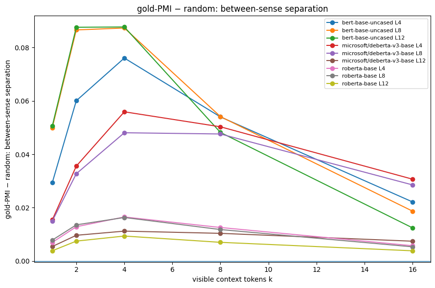
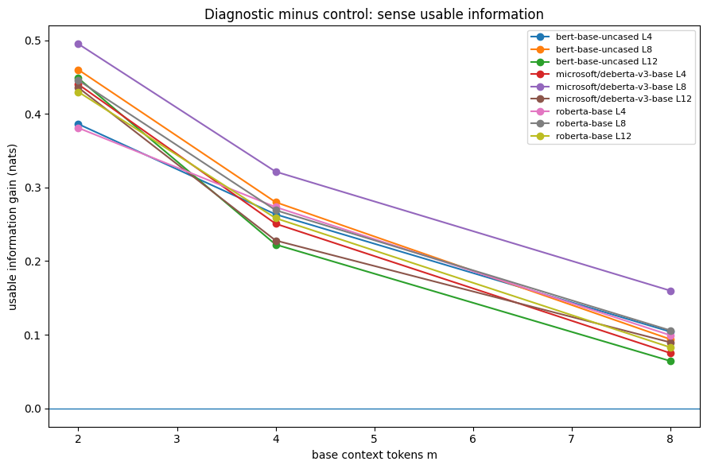

# Beyond Contraction: Contextual Evidence Separates Lexical Senses Without Universal Within-Sense Collapse

**Hồ Ngọc Huy**  
Undergraduate, University of Science, VNU-HCM  
ORCID: [0009-0007-4156-352X](https://orcid.org/0009-0007-4156-352X)  
Independent Study · August 2026

## Abstract

Context can make the intended sense of an ambiguous word easier to recover. A tempting geometric interpretation is that representations should therefore collapse into a tighter same-sense cluster. We test that interpretation directly in frozen BERT-base, RoBERTa-base, and DeBERTa-v3-base representations of 19 coarse ambiguous English nouns. When sense-diagnostic context is compared with the same amount of randomly selected context, between-sense separation increases in every aggregate model × layer × evidence cell, while within-sense dispersion can decrease, remain nearly unchanged, or increase. A nested intervention then holds the existing context fixed and adds one diagnostic or matched control cue. Diagnostic cues increase linear sense accessibility and produce updates that align more with a supervised sense-discriminative subspace, but they also change broader representational structure. A newly fit decoder recovers a fixed low-dimensional summary of the previous context about as well as controls, whereas a decoder trained on the pre-cue state transfers less well. Label-independent local context, LEACE erasure, and RAW-C provide complementary checks. The narrow conclusion is that lexical disambiguation need not be geometric contraction. We use *sense-directed reorganization* only as a descriptive name for the observed pattern, not as a universal computational mechanism.

## 1. A simple geometric question

`bank` can refer to a financial institution or a river edge. After seeing `mortgage`, the financial sense becomes much easier to identify. It is natural to picture this as a shrinking region of possible meanings,

\[
R_0 \supset R_1 \supset R_2 \supset \cdots .
\]

That picture mixes two different objects. A contextual encoder produces one vector \(h=E(w,c)\) for one occurrence. A “cloud” appears only after we collect vectors from many contexts. Its spread is therefore not itself a posterior distribution over lexical senses. Two sentences can make the same sense unambiguous while differing in event, topic, participants, syntax, or discourse role.

The paper tests the corresponding geometric inference rather than semantic uncertainty itself:

\[
\textbf{sense accessibility} \neq \textbf{within-sense geometric dispersion}.
\]

This distinction matters because recent work increasingly interprets contextual representations geometrically. Lexical ambiguity studies show strong layer- and architecture-dependent sense differentiation (Ma et al., 2025; Rivière et al., 2025), while recent 2026 work treats contextual change as structured transformation or reorganization rather than small stationary perturbation (Hu et al., 2026; Xiong et al., 2026). Other work shows that embedding similarity can diverge from functional sense distinctions in late decoder layers (Scott et al., 2026), and mechanistic analyses identify attention components that contribute causally to disambiguation (Rivière & Trott, 2025). Our axis is complementary: instead of asking primarily how a fixed input evolves through depth, we manipulate how much *sense-relevant contextual evidence* is available.

**Scope before results.** We do not estimate \(H(S\mid C)\), equate probe accuracy with model “understanding,” treat a supervised subspace as a discovered privileged internal axis, or claim that a low-dimensional reconstruction target captures all context. The oracle cue selection below is an intervention for measurement, not a deployable WSD method. These restrictions are important because they prevent an easy geometric observation from silently becoming a stronger semantic or mechanistic claim.

## 2. Experimental design

### 2.1 Data and representations

We use CoarseWSD-20, a Wikipedia-derived benchmark of ambiguous English nouns with 2–5 coarse senses. After within-word balancing and context-availability filtering, 19 lexical items remain; `deck` falls below the held-out minimum. The statistical unit is the lexical item, not individual token pairs.

We freeze BERT-base-uncased, RoBERTa-base, and DeBERTa-v3-base and extract target-token representations from layers 4, 8, and 12, averaging target subwords when necessary. Because model families differ in scale and anisotropy, cross-architecture conclusions rely on signs and within-model trajectories rather than raw magnitude comparisons.

For sense \(s\) with probability \(p_s\), sense mean \(\mu_s\), and global mean \(\mu\), we decompose total covariance trace into

\[
W=\sum_s p_s\operatorname{tr}\operatorname{Cov}(Z\mid S=s),
\]

\[
B=\sum_s p_s\lVert \mu_s-\mu\rVert_2^2,
\]

so that \(\operatorname{tr}\operatorname{Cov}(Z)=W+B\). Here \(W\) measures within-sense dispersion and \(B\) measures between-sense centroid separation.

Linear sense accessibility is measured as reduction in held-out negative log likelihood relative to a null predictor,

\[
I_V(S;Z)=\mathrm{NLL}_{\mathrm{null}}-\mathrm{NLL}_{\mathrm{probe}},
\]

reported in nats for a fixed linear probe family. This is deliberately called *linear accessibility*, not mutual information.

### 2.2 Experiment A: controlled evidence

Token–sense PMI is estimated from the official training split only. For each held-out occurrence, an oracle ordering reveals the remaining context tokens with highest PMI for the gold sense. Five random reveal orderings provide matched context-quantity controls. We compare \(k\in\{1,2,4,8,16\}\) visible tokens. BERT additionally receives a deletion-based artifact check.

The test is intentionally simple: if disambiguation generally behaves like contraction, diagnostic context should not only improve sense differentiation; it should also reliably reduce \(W\) relative to equally large random context.

### 2.3 Experiment B: one cue from the same starting state

Experiment A compares clouds aggregated over many context variants. Experiment B removes a simpler objection by holding the pre-existing context identical. Each occurrence starts from a label-independent random base context of \(m\in\{2,4,8\}\) tokens. We then add either the highest-PMI remaining diagnostic cue or a matched control cue:

\[
h_{\text{base}}=E(w,C_{\text{base}}),\quad
h_{\text{diag}}=E(w,C_{\text{base}}\cup\{c_{\text{diag}}\}),\quad
h_{\text{ctrl}}=E(w,C_{\text{base}}\cup\{c_{\text{ctrl}}\}).
\]

We ask four separate questions: does sense become more linearly accessible; does the update \(\delta=h_{\text{post}}-h_{\text{pre}}\) place more energy in a supervised sense-discriminative subspace; does broader structure remain similar to the base state (CKA/RSA); and does a fixed lexical summary of the old context remain recoverable?

The supervised sense subspace is the span of training-set sense-mean offsets \(\{\mu_s-\mu\}\). Because the probe and this subspace share gold labels, their association is descriptive evidence of sense-structured change, not an unsupervised discovery.

For the old-context diagnostic, the pre-cue context is encoded with a training-only TF-IDF unigram/bigram vectorizer, reduced with TruncatedSVD to at most 64 dimensions and row-normalized. Ridge decoders predict that fixed target from the token representation. We compare a decoder fit separately after each condition with transfer of a decoder trained on the base state without refitting. This target is a lexical summary, not a complete representation of context.

### 2.4 Validation

Three checks test whether the main story depends on the oracle setup.

**Natural local context.** Context expands by nearest-token distance only (2, 4, 8, 16 tokens); gold labels are used only afterward for evaluation.

**Linear sense erasure.** LEACE is fit on training diagnostic states and applied to held-out states. We remeasure sense accessibility and old-context reconstruction. This supports claims about linear accessibility only.

**RAW-C.** For 672 natural sentence pairs, target-token cosine similarity is compared descriptively with human graded relatedness and same/different-sense labels.

For paired CoarseWSD effects we resample lexical items, not token pairs. Aggregate counts such as “45/45” are descriptive robustness summaries, not independent replications. Natural-transition and RAW-C pair-level p-values are not used for paper-level inference because observations are clustered by lexical item.

## 3. Results

### 3.1 Diagnostic evidence separates senses; it does not impose universal contraction

The diagnostic-minus-random change in between-sense separation \(B\) is positive in all 45 aggregate model × layer × evidence cells. Within-sense dispersion \(W\) behaves differently across architectures.

At layer 12 and \(k=2\), BERT has \((\Delta W,\Delta B)=(-0.0117,0.0876)\), RoBERTa approximately \((0,0.0074)\), and DeBERTa-v3 \((0.0139,0.0096)\). Thus the shared effect is stronger sense differentiation, not a common contraction law.

The BERT deletion check preserves the qualitative between-sense direction, but equivalent artifact controls were not run for RoBERTa and DeBERTa-v3.

### 3.2 A diagnostic cue changes more than a pure sense coordinate

From an identical base context, a diagnostic cue increases linear sense accessibility relative to matched controls by a mean of **+0.265 nats** across the aggregate grid. The update also places a larger fraction of its energy in the supervised sense subspace (**+0.032** diagnostic-minus-control on average).

At the same time, structural similarity to the pre-cue state is lower under diagnostic cues: mean CKA diagnostic-minus-control is **−0.050**, and orthogonal residual variation is positive in most aggregate cells. The simple picture “old vector + one sense-only displacement” is therefore incomplete.

A fresh decoder fit after the update changes old-context reconstruction only slightly relative to control (**+0.00194** cosine on average), while a decoder trained on the base state transfers less well (**−0.00802**). Taken together with lower CKA, this is consistent with a change in representational organization rather than indiscriminate loss of the fixed old-context target. It does not identify a unique transformation.

### 3.3 Non-oracle context shows the same qualitative direction

When context is expanded by distance alone, linear sense accessibility usually rises from 2 to 16 visible tokens. Mean usable-information gains are positive for every model/layer/transition in the executed notebook, with diminishing gains at richer contexts. The descriptive correlation between accessibility gain and supervised sense-update alignment is positive in all nine model/layer settings, strongest for BERT and weaker for DeBERTa-v3 layer 12. Because each word contributes multiple transitions, these correlations are reported as effect sizes rather than naive independent-point significance tests.

### 3.4 Linear sense erasure has limited damage to the fixed lexical context target

LEACE substantially reduces held-out linear sense accessibility. For BERT layer 12, usable information falls from **0.621** to **0.199 nats** and balanced accuracy from **0.894** to **0.590**, while old-context reconstruction cosine changes from **0.1802** to **0.1784–0.1785**. Across the tested model/layer settings, relative reconstruction loss is roughly **1.0–1.5%**.

This supports partial *linear* separability between the removed sense signal and the fixed lexical context target. It does not imply nonlinear independence or complete concept deletion.

### 3.5 External semantic alignment

On RAW-C, target-token cosine similarity correlates positively with graded human relatedness in every model/layer setting (Spearman \(\rho=.438\)–\.693). Same-versus-different-sense AUC ranges from **.764** to **.912**. This is an external validity check for the representation geometry, not a replication of the controlled intervention and not evidence that humans and models share a mechanism.

## 4. What the result does and does not buy us

The strongest conclusion is intentionally small: **more recoverable lexical-sense information does not require a universal collapse of same-sense representation geometry.** A contextual token can become easier to classify by coarse sense while still encoding many distinctions among events, topics, entities, syntax, and discourse. Between-sense structure can sharpen while within-sense degrees of freedom remain.

The phrase *sense-directed reorganization* summarizes four observations: controlled evidence differentiates senses; diagnostic updates contain a stronger supervised sense-related component; broader structural similarity changes; and a fixed old-context target is not proportionately destroyed. None of those observations alone establishes a universal transformer mechanism.

The main threats are equally concrete. The sense subspace and probe share supervision; a label-permutation or matched-random-subspace null would sharpen the “sense-directed” interpretation. The TF-IDF/SVD target is low-dimensional and lexical; richer independently defined context targets could reveal losses it misses. The masking artifact check is BERT-specific. The controlled dataset covers 19 English nouns with coarse senses. Finally, geometry itself is representation-dependent: anisotropy and rogue dimensions make raw cross-model distances unsafe to interpret as common units.

These limitations narrow the claim, but they do not change the simplest observation: the same manipulation that makes senses easier to distinguish does not produce a common within-sense contraction trajectory across the three encoders.

## 5. Conclusion

A geometric intuition can be useful even when it fails. If contextual disambiguation were equivalent to a shrinking same-sense cloud, diagnostic evidence should reliably reduce within-sense dispersion. It does not. Across the tested encoders, the stable effect is increased differentiation between senses, accompanied by model-dependent within-sense geometry and broader changes under nested cue interventions. Context can therefore make lexical sense more accessible without making the representation geometrically simple.

## References

- Belrose, N., Schneider-Joseph, D., Ravfogel, S., Cotterell, R., Raff, E., & Biderman, S. (2023). *LEACE: Perfect linear concept erasure in closed form*. NeurIPS 36.
- Ethayarajh, K. (2019). *How contextual are contextualized word representations? Comparing the geometry of BERT, ELMo, and GPT-2*. EMNLP-IJCNLP.
- Hewitt, J., & Liang, P. (2019). *Designing and interpreting probes with control tasks*. EMNLP-IJCNLP.
- Hu, Z., Niu, L., & Varma, S. (2026). *Language Models Represent and Transform Concepts with Shared Geometry*. arXiv:2607.04525.
- Loureiro, D., Rezaee, K., Pilehvar, M. T., & Camacho-Collados, J. (2021). *Analysis and evaluation of language models for word sense disambiguation*. Computational Linguistics, 47(2), 387–443.
- Ma, M. K.-H., Chenwei, X., Wang, W., & Wang, W. S. (2025). *Exploring Layer-wise Representations of English and Chinese Homonymy in Pre-trained Language Models*. Findings of ACL 2025, 19705–19724.
- Pandey, V., & Singh, G. (2026). *Trajectory geometry of transformer representations across layers*. arXiv:2606.09287.
- Rivière, P. D., Beatty-Martínez, A. L., & Trott, S. (2025). *Evaluating Contextualized Representations of (Spanish) Ambiguous Words: A New Lexical Resource and Empirical Analysis*. NAACL 2025, 8322–8338.
- Rivière, P. D., & Trott, S. (2025). *Start Making Sense(s): A Developmental Probe of Attention Specialization Using Lexical Ambiguity*. arXiv:2511.21974.
- Scott, K. J., Pat, N., & Liesaputra, V. (2026). *Divergent large language model predictions from convergent representations in ambiguous word pairs*. arXiv:2608.01816.
- Timkey, W., & van Schijndel, M. (2021). *All bark and no bite: Rogue dimensions in transformer language models obscure representational quality*. EMNLP.
- Trott, S., & Bergen, B. (2021). *RAW-C: Relatedness of Ambiguous Words in Context*. ACL-IJCNLP.
- Wang, Y., & Zhang, Y. (2023). *Lost in context? On the sense-wise variance of contextualized word embeddings*. IEEE/ACM TASLP.
- Xiong, H.-D., Li, J.-A., Wilson, R. C., Lee, K., & Wei, X.-X. (2026). *Large language models reorganize representational geometry during in-context learning*. arXiv:2605.28854.
- Yenicelik, D., Schmidt, F., & Kilcher, Y. (2020). *How does BERT capture semantics? A closer look at polysemous words*. BlackboxNLP.
